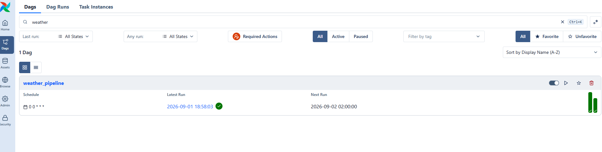
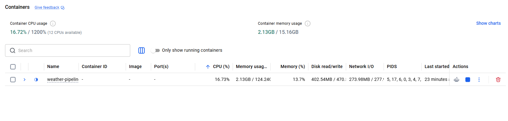
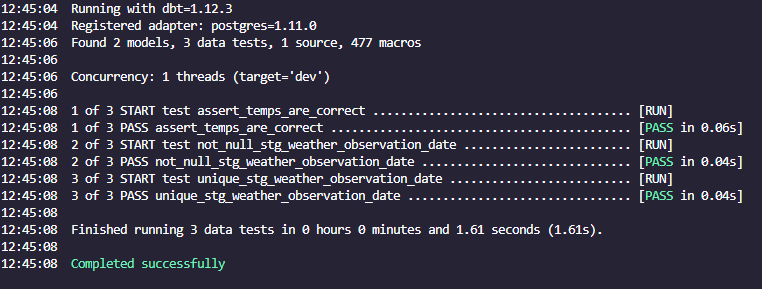
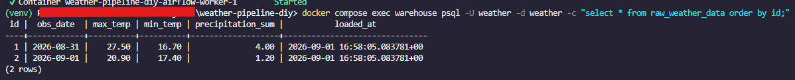
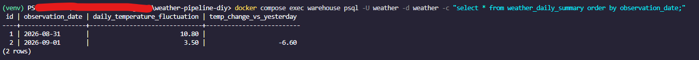
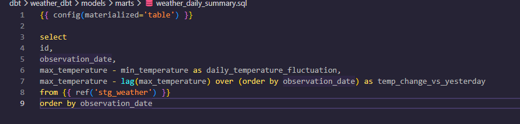

# Weather dbt + Airflow Pipeline

This project is my follow-up to [nbp-eur-exchange-pipeline](https://github.com/Strangelove1/nbp-eur-exchange-pipeline). That project was a fully manual Python → Postgres → hand-run-SQL pipeline. This one automates the same shape of pipeline with **Airflow** (scheduling) and replaces the hand-run SQL with a **dbt** project (versioned, tested transforms). 

This one can pull daily weather data for Warsaw, Poland from the free [Open-Meteo](https://open-meteo.com/) API, loads it into Postgres, and transforms it with dbt — including a window function that tracks day-over-day temperature change, the same kind of logic like the one used for the "biggest single-day rate change" query in the NBP project.

UPDATE: I added a data visualisation in PowerBI to the repo. It is rather simple as of now because of the low index count, however I wanted to showcase where I can transfer the data for taking key insights from it. 

## Pipeline Overview

One Airflow DAG (`weather_pipeline`), scheduled daily, with four tasks:

1. **`extract_weather`** (`extract/extract_weather.py`) — calls the Open-Meteo forecast API for Warsaw and saves the raw JSON response to `data/raw/`, named by run date.
2. **`load_weather`** (`load/load_weather.py`) — parses that JSON and upserts rows into `raw_weather_data` in Postgres (`ON CONFLICT ... DO UPDATE`, so re-running the same day's task updates rather than duplicates).
3. **`dbt_run`** — builds the dbt models:
   - `stg_weather` (staging view) — cleans up and renames columns from the raw table.
   - `weather_daily_summary` (mart table) — daily temperature range, plus day-over-day max-temp change via `LAG()`.
4. **`dbt_test`** — runs dbt's data tests: `not_null`/`unique` schema tests on `stg_weather`, plus a singular test (`assert_temps_are_correct.sql`) asserting max temperature is never below min temperature.

## Tech Stack

- **Apache Airflow 3.3** — orchestration/scheduling, run via Docker Compose (CeleryExecutor)
- **dbt-core / dbt-postgres** — SQL transforms, versioned models, and automated data tests
- **PostgreSQL 16** — two separate instances: one for Airflow's own metadata, one (`warehouse`) for the pipeline's actual data
- **Python** — extraction and loading (`requests`, `psycopg2`)
- **Open-Meteo API** — free, no API key required
- **Docker / Docker Compose** — containerizes the whole stack so it runs the same way anywhere

## How to Run

Requires [Docker Desktop](https://www.docker.com/products/docker-desktop/) installed and running.

1. **Clone the repo**, then copy the env file:
   ```bash
   cp .env.example .env
   ```
2. **Build the custom Airflow image** (adds dbt + Python deps on top of the official image):
   ```bash
   docker compose build
   ```
3. **Start everything**:
   ```bash
   docker compose up -d
   ```
   First start takes a few minutes (`airflow-init` runs migrations and creates the admin user).
4. **Open the Airflow UI** at [http://localhost:8080](http://localhost:8080) (default login: `airflow` / `airflow`, unless changed in `.env`).
5. **Unpause and trigger** the `weather_pipeline` DAG. Watch all four tasks turn green.
6. **Inspect the result** directly in the warehouse Postgres (exposed on host port `5433`, so pgAdmin works too):
   ```bash
   docker compose exec warehouse psql -U weather -d weather -c "select * from weather_daily_summary;"
   ```

## Example Output

**The `weather_pipeline` DAG, scheduled daily and passing:**



**The full stack running in Docker:**



**All 4 DAG tasks succeeding, and `dbt test` passing on real data:**



**Raw weather data loaded into Postgres:**




**The final `weather_daily_summary` mart, with `LAG()`-based day-over-day temperature change:**



## What I Learned

- Turned a set of manually-run scripts into a scheduled, self-healing Airflow DAG — `PythonOperator` and `BashOperator` tasks, chained with `>>`, each one only running once its predecessor succeeds.
- Used dbt to replace hand-run SQL with versioned, testable models — staging vs. marts layering, `ref()`/`source()` for dependency tracking, and a window function (`LAG()`) inside a dbt model instead of a standalone SQL script.
- Wrote dbt tests two ways: generic schema tests (`not_null`, `unique`) and a singular SQL test as an explicit assertion — a natural extension of a QA mindset into data pipelines.
- Containerized the whole pipeline with Docker Compose: a custom `Dockerfile` extending the official Airflow image, a second Postgres service (`warehouse`) kept separate from Airflow's own metadata database, and volume mounts so the containers can see the project's actual code.
- Learned the difference between a database constraint (prevents bad data at write time) and a dbt test (checks data that's already there, but can express much more complex logic).
- Refactored extract/load scripts to accept Airflow's own execution date (`context["ds"]`) instead of each independently guessing a date, so every task in a run stays consistent about which day's data it's working with.
- Made the load step idempotent (`ON CONFLICT ... DO UPDATE`) so re-running a DAG task for the same day doesn't create duplicate rows.
- Debugged a lot of infrastructure that has nothing to do with Python or SQL: YAML indentation, Docker volume mounts, `.gitignore` gaps that almost let a real password get committed, and Windows-specific friction (PowerShell execution policy, venv activation being per-terminal).


## Shoutout to Claude Code. I've begun my adventure with data engineering not very long ago and Claude has been an incredibly helpful tool which I've been using to learn and understand the fundamentals and mechanics of data engineering. Without it I surely would've been learning at a much slower rate. It's capabilities for explaining, generating examples and documentation, bug-fixing and connecting the dots are outstanding. I'm definitely looking forward into growing in a data specialist role with Claude as a mentor.

..Honestly it's crazy how a desktop AI app can fulfill the role of a teacher. I can take all the time I need figuring out the basics and there's always the possibility to ask any questions I want, and I will always have them explained the way I want. Cool af.
